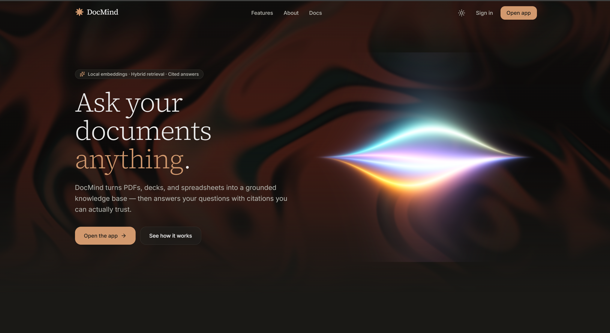
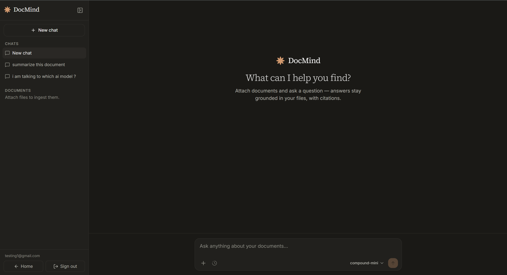
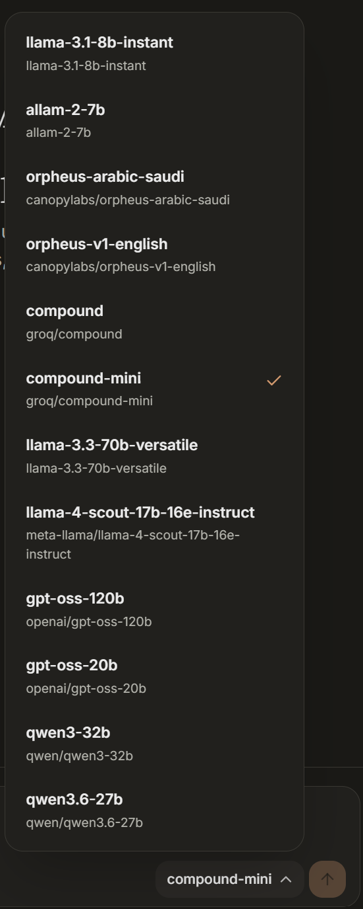

# DocMind

**Ask questions. Get answers grounded strictly in your own documents.**

DocMind is a local-first RAG (Retrieval-Augmented Generation) web app. Upload your PDFs, Word docs, spreadsheets, images, and more — then chat with them. Every answer is cited from your files.

### ▶ Try it live: **[docmind-snowy.vercel.app](https://docmind-snowy.vercel.app/)**



---

## What it is

Search finds pages; DocMind answers questions. Drop in a mix of documents and ask away — DocMind retrieves the most relevant passages from *your* files and uses them to compose a grounded, cited answer. If the answer isn't in your documents, it says so. Your files are parsed and embedded locally, and each conversation gets its own isolated, ephemeral vector store.

---

## Screenshots

| Chat with your documents | Pick any model |
|---|---|
|  |  |

---

## Features

- **Multi-format** — PDF (incl. scanned/OCR), DOCX, PPTX, XLSX, CSV, JSON, TXT, MD, HTML, PNG/JPG
- **Auto-ingest** — Files are processed the moment you attach them
- **Hybrid retrieval** — Vector + keyword search, fused and reranked for relevance
- **Grounded & cited** — Answers come only from your documents
- **Per-session isolation** — Each chat has its own vector store; sessions are ephemeral
- **Live model selector** — Switch between Groq models mid-conversation
- **100% local ML** — Embedding and reranking run on CPU; only the final answer uses the Groq API

---

## Tech stack

| Layer | Tech |
|-------|------|
| Frontend | Next.js 16 + React 19 (Tailwind v4) |
| Backend | FastAPI + Uvicorn |
| Retrieval | ChromaDB (vectors) + BM25 (keywords) + FlashRank (reranking) |
| Embeddings | BAAI/bge-base-en-v1.5 (local, CPU) |
| LLM | Groq API |

---

## Run it locally

Requires **Python 3.12**, **Node.js 20+**, and a free [Groq API key](https://console.groq.com/keys). (Tesseract OCR is optional — only for scanned PDFs and images.)

```bash
# Clone
git clone https://github.com/kishan5822/DocMind.git
cd DocMind

# Backend
py -3.12 -m venv .venv            # Windows  (python3.12 on macOS/Linux)
.venv\Scripts\activate            # source .venv/bin/activate on macOS/Linux
pip install -r requirements.txt
cp .env.example .env              # then set GROQ_API_KEY
uvicorn api.main:app --reload --port 8000

# Frontend (second terminal)
cd web
npm install
npm run dev
```

Open [http://localhost:3000](http://localhost:3000). The first run downloads the embedding and reranker models (~500 MB, cached locally).

All other settings (chunk size, retrieval counts, file limits, etc.) have safe defaults — see [.env.example](.env.example).

---

## License

MIT
